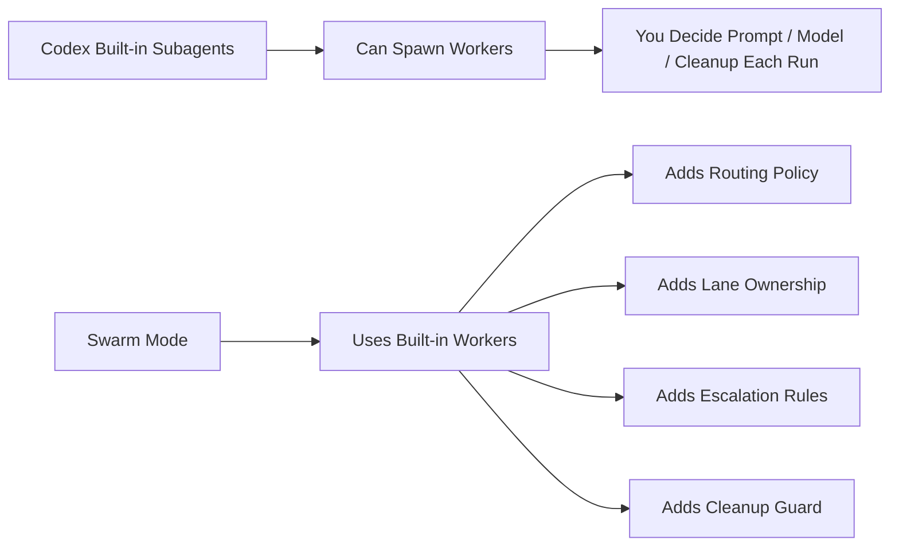

# Swarm Mode

Swarm Mode is a Codex skill for swarm-style orchestration.

It keeps one main orchestrator, splits work into parallel lanes, caps active workers at 30, and routes each lane through a shared model policy in `config/model-routing.json`.

> Based on a secondary development of [huaqiang-huang/codex-swarm-mode-skill](https://github.com/huaqiang-huang/codex-swarm-mode-skill).

## At A Glance

## Built-in vs Swarm Mode

| Item | Built-in agent team / subagent | Swarm Mode |
| --- | --- | --- |
| Role | execution primitive | orchestration layer on top |
| Worker split | ad hoc per run | lane-based and explicit |
| Model choice | manual / prompt-time | routed by `config/model-routing.json` |
| Risk control | depends on operator | escalation rules built in |
| Repo compatibility | no default policy check | checks repo override before spawn |
| Cleanup | manual habit | workflow rule, optional assert-clean |

一句话：内置 subagent 解决“能不能并发”，Swarm Mode 解决“并发怎么稳定落地”。

## Advantages

- 更稳：先分 lane，再选模型，再派角色，减少乱派和重叠写入
- 更省：把高判断任务留给强模型，把窄范围任务下放到低成本模型
- 更安全：高风险、歧义、跨模块任务会自动升回主 orchestrator
- 更可复用：规则写在文件里，团队可以审查、调参、版本化

适用场景：当你只需要 1 到 2 个临时 helper 时，内置 subagent 通常够用；当你要长期、多次、成体系地跑多代理协作时，Swarm Mode 更合适。

## Files

- `SKILL.md`: main skill definition and operating rules
- `config/model-routing.json`: routing profiles, escalation rules, and role policy
- `agents/openai.yaml`: agent metadata and default prompt
- `references/prompt-templates.md`: reusable prompt scaffolds for main-agent and worker lanes

## Usage

Install this skill into your Codex profile, then invoke `$swarm-mode` when you want Codex to decompose a task into parallel worker lanes.
