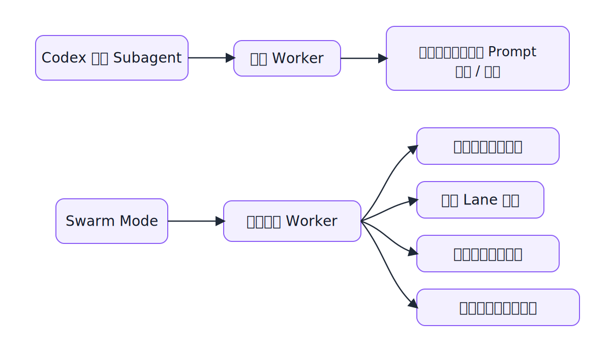

# Swarm Mode

Swarm Mode 是一个用于蜂群式编排的 Codex Skill。

它会保留一个主 orchestrator，把任务拆成并行 lane，把活跃 worker 上限控制在 30 个以内，并通过 `config/model-routing.json` 统一做模型路由。

> 基于 [huaqiang-huang/codex-swarm-mode-skill](https://github.com/huaqiang-huang/codex-swarm-mode-skill) 二次开发。

## 一图看懂

## 内置能力 vs Swarm Mode

| 对比项 | 内置 agent team / subagent | Swarm Mode |
| --- | --- | --- |
| 它是什么 | 内置的 worker 能力 | 多代理协作的管理层 |
| 怎么拆任务 | 每次临时决定 | 派发前先拆清楚 lane |
| 怎么选模型 | 靠当次 prompt 手动指定 | 按 `config/model-routing.json` 统一路由 |
| 风险怎么处理 | 取决于操作者经验 | 高风险任务自动升回主 orchestrator |
| 仓库规则怎么处理 | 没有默认检查 | 派发前先检查 repo override |
| 怎么收尾 | 容易忘 | 流程内置，可做 assert-clean |

一句话：内置 subagent 是“派人干活”的能力，Swarm Mode 是“怎么派、谁来兜底、最后怎么收尾”的规则层。

## 优势

- 更稳：先分 lane，再选模型，再派角色，减少乱派和重叠写入
- 更省：把高判断任务留给强模型，把窄范围任务下放到低成本模型
- 更安全：高风险、歧义、跨模块任务会自动升回主 orchestrator
- 更可复用：规则写在文件里，团队可以审查、调参、版本化

适用场景：当你只需要 1 到 2 个临时 helper 时，内置 subagent 通常够用；当你要长期、多次、成体系地跑多代理协作时，Swarm Mode 更合适。

## 文件结构

- `SKILL.md`：主技能定义和工作规则
- `config/model-routing.json`：路由档位、升级规则和角色策略
- `agents/openai.yaml`：agent 元信息和默认 prompt
- `references/prompt-templates.md`：主 agent / worker 的提示词模板

## 使用方式

把这个 skill 安装到你的 Codex profile 里；当你想让 Codex 按并行 lane 拆任务时，直接调用 `$swarm-mode`。
